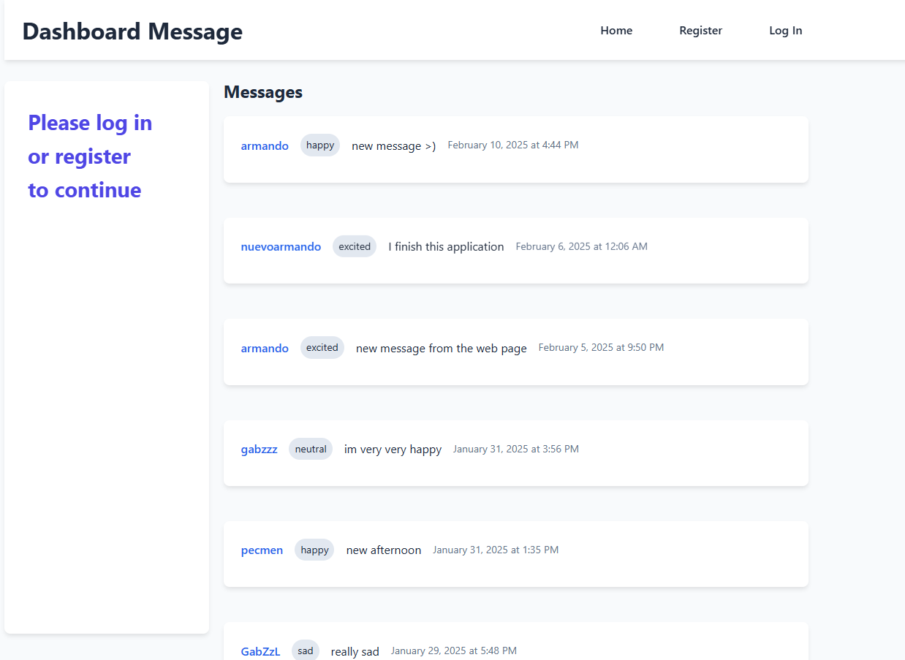
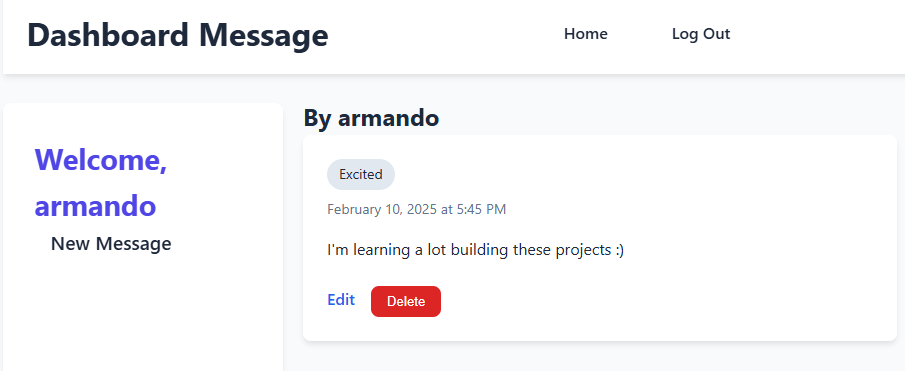
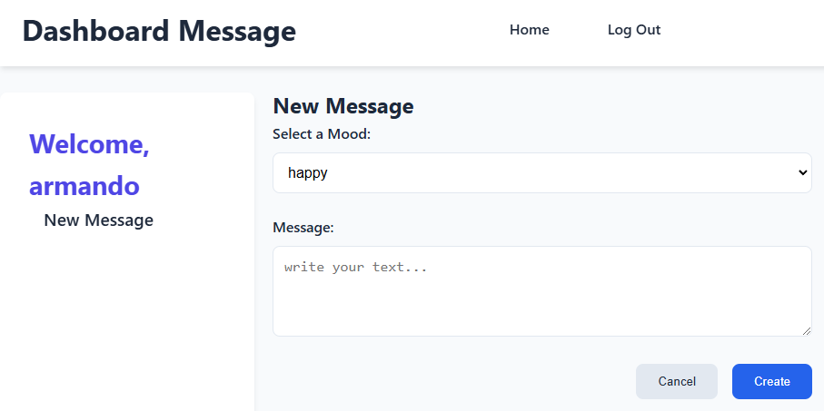
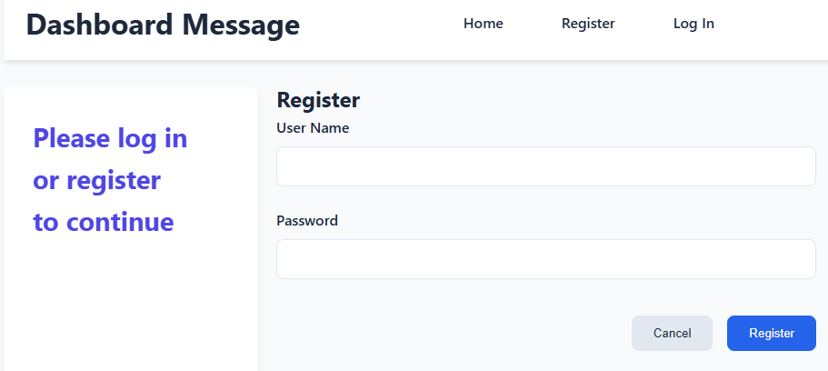

# MessageBoard: Full-Stack Social Posting App

A full-stack web application for sharing and managing user-generated posts with secure authentication and real-time interactions.

## ✨ Features

- **User Authentication**: JWT-based registration/login with password hashing.
- **Post Management**: Create, edit, update, and delete posts.
- **Form Validation**: Backend validation via Zod for secure data handling.
- **Protected Routes**: React Router ensures only authenticated users can post/edit.
- **Responsive UI**: Styled with CSS Modules for clean, maintainable designs.

## 🛠️ Tech Stack

**Frontend**:

- React 18 + Vite
- React Router v6
- Context API (State Management)
- CSS Modules

**Backend**:

- Express.js
- MongoDB (with Mongoose ODM)
- Zod (Schema Validation)
- JWT (Authentication)

## 🛠️ Tech Stack

**Home Page**:

**Message Details**:

**Create Message**:

**Register User**:

